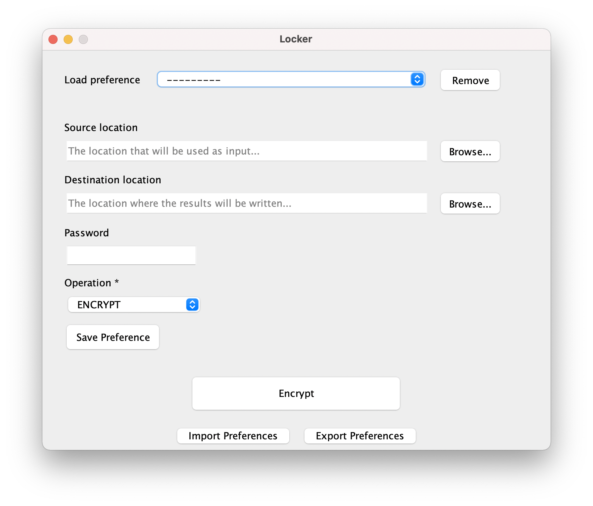
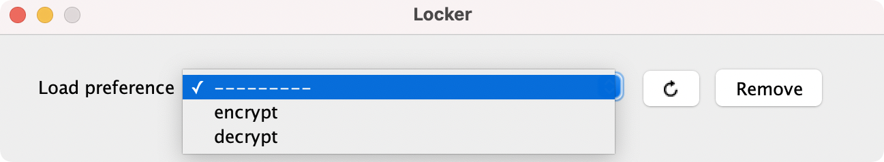
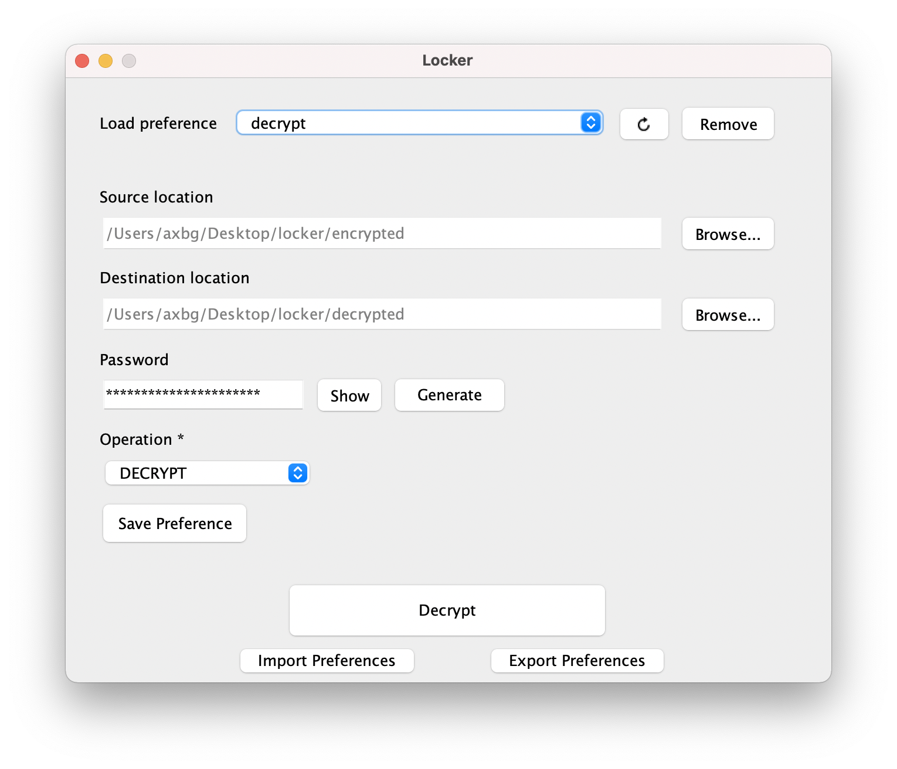

# locker

An app meant to simplify encryption and management of regularly updated files... in some particular use-cases.

If a configuration is used often, it can be saved as a *Preference*, by clicking on the *Save Preference* button after a
value for each field is provided.

Then, the preference can be applied afterwards, by selecting it in the *Load preference* dropdown.

#

You can clone the repo and build the app, or directly download the provided [jar](./locker.jar).

**shelf.jar SHA-512 checksum:**
9CF6245C61FE1D3EED74732A12C26A4A215B096FE2B583CF7742EFF51F680603