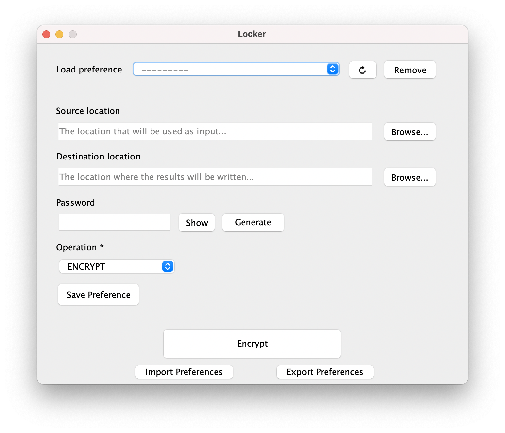

# locker

An app meant to simplify encryption and management of regularly updated files... in some particular use-cases.

If a configuration is used often, it can be saved as a *Preference*, by clicking on the *Save Preference* button after a
value for each field is provided.

Then, the preference can be applied by selecting it in the *Load preference* dropdown.

If you would like to move your preferences to another PC or share them with somebody else, you can use the
**Export Preferences/Import Preferences** feature.

Your preferences will be encrypted with a password of choice and will be exported to a selected location.

The import process is similar: select the encrypted preferences file, provide the right password and, optionally, an
extension that will be appended after each imported name.

The imported preferences will be added along with the existing ones, overwriting those that share the same name.

Additionally, if you feel like your password minting game is not that strong, you can rely on the embedded password
generator that will create a complex, hard-to-break password.

#

You can clone the repo and build the app, or directly download the provided [jar](./locker.jar).

**shelf.jar SHA-512 checksum and VirusTotal scan report:**
[FF52D672FF31F986BC5BB36B7E06C1499AE51E9519CDB10E6AF616F549D81502](https://www.virustotal.com/gui/file/FF52D672FF31F986BC5BB36B7E06C1499AE51E9519CDB10E6AF616F549D81502/detect)